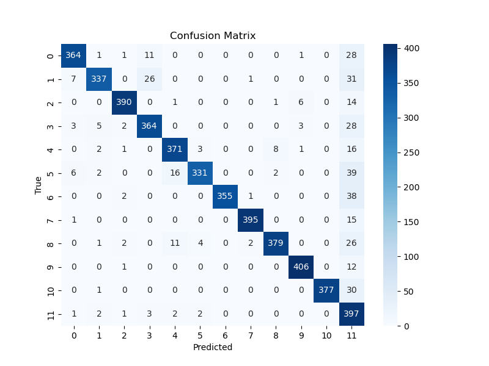
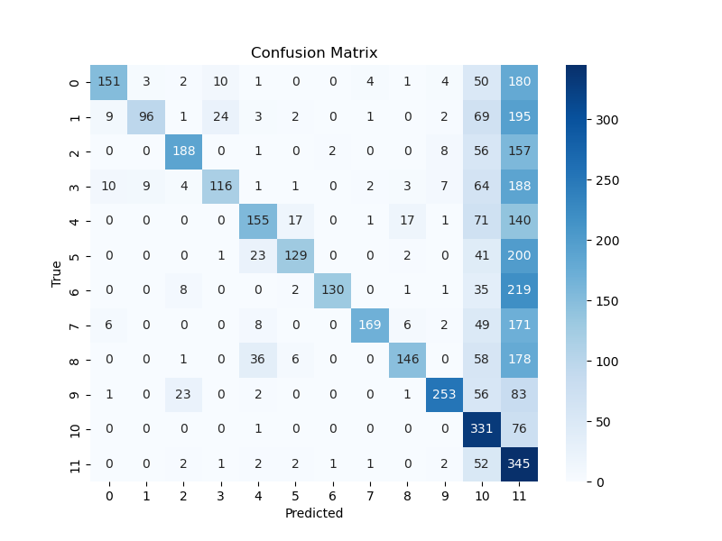
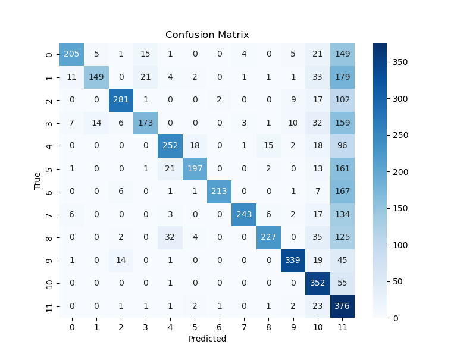
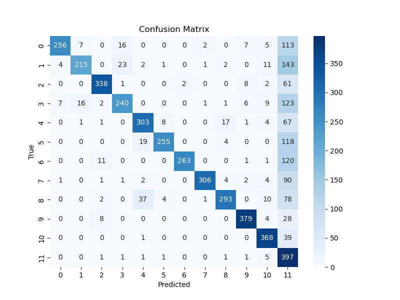
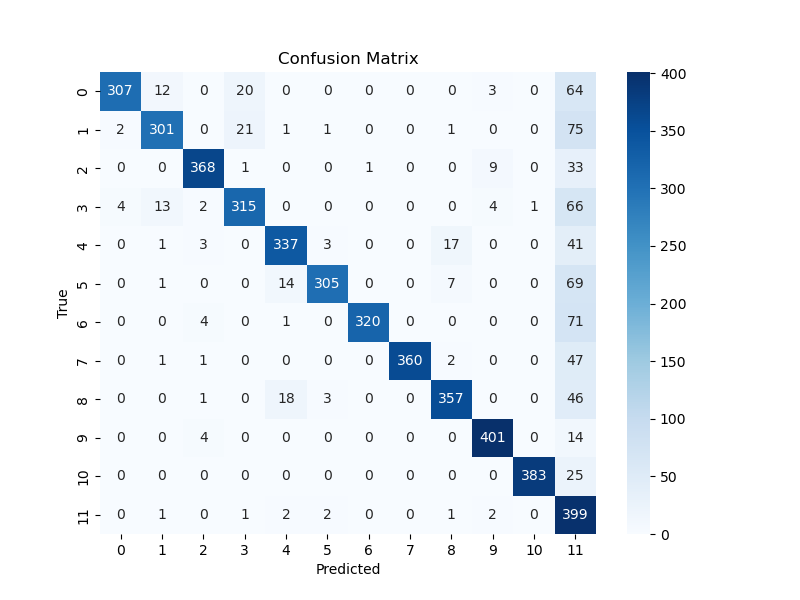
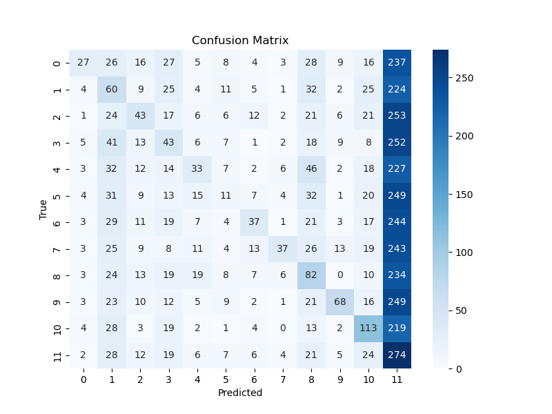
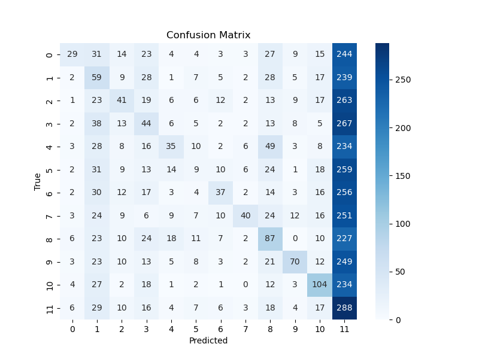

# Evaluation Pipeline

This folder contains scripts for evaluating the trained keyword spotting model
under clean and noisy conditions.

The evaluation pipeline provides:

- Clean test-set evaluation  
- Noisy evaluation using MUSAN noise  
- Confusion matrices and quantitative performance metrics  

---

## Clean Evaluation

The model is evaluated on the clean Speech Commands test set using
Cross Entropy loss and classification accuracy.

- **Test set size**: 4,890 samples  
- **Loss**: 0.29200  
- **Accuracy**: 0.90041  

### Confusion Matrix

*Most commands are predicted correctly. A noticeable portion of samples from
command classes are misclassified as `_unknown_`, which is expected due to
acoustic variability. Notably, there are no predictions of non-silence classes
as `_silence_`, which is consistent with the role of the silence class.*

---

## Noisy Evaluation

Noisy evaluation measures model robustness by adding real-world background noise
from the MUSAN dataset to the clean test samples.

- **Noise dataset**: MUSAN (free-sound subset)  
- **SNR levels tested**: 0, 5, 10, 20 dB  

### Noise Alignment Strategy

To ensure a fair comparison with the clean test set:

- All MUSAN noise files are trimmed into fixed **1-second segments**
- Exactly one noise segment is selected per test sample
- Noise segments are optionally shuffled with a fixed seed
- The selected noise array has shape `(test_size, sr)`

This ensures a **one-to-one alignment** between clean speech samples and noise
segments before noise addition.

> See `prepare_noise_for_test()` in `src/noise/utils.py` for implementation details.

> Details about noise addition are described in the [Noise pipeline](../noise/README.md)

---

### Quantitative Results

| SNR   | Loss    | Accuracy |
|-------|---------|----------|
| 0 dB  | 1.70245 | 0.45174  |
| 5 dB  | 1.11625 | 0.61493  |
| 10 dB | 0.76190 | 0.73885  |
| 20 dB | 0.43687 | 0.84928  |

As expected, performance degrades significantly at low SNRs and gradually
recovers as noise intensity decreases.

---

### Confusion Matrices (Noisy)

#### SNR = 0 dB

#### SNR = 5 dB

#### SNR = 10 dB

#### SNR = 20 dB

*With increasing SNR, confusion between commands decreases and overall accuracy
improves. At low SNRs, misclassification into the `_unknown_` class becomes
dominant, reflecting the impact of strong background noise.*

---

## Denoised Evaluation

In addition to noisy evaluation, we analyze the effect of applying
classical signal-processing denoising methods **before feature extraction**
on the noisy test set.

The goal is to assess whether traditional denoising improves keyword
classification robustness under additive noise.

The following denoising algorithms were evaluated:

* **Wiener filtering**
* **Spectral subtraction**

Noise Power Spectral Density (PSD) was estimated either from the known
noise segments or using blind estimation techniques (energy-based VAD or
minimum statistics). Full details are provided in the
[Noise pipeline](../noise/README.md).

---

### Results Summary

Contrary to expectations, applying denoising **significantly degraded**
classification performance across all tested SNR levels.

| Method               | SNR (dB) | Loss ↓ | Accuracy ↑ |
| -------------------- | -------- | ------ | ---------- |
| Wiener Filter        | 0        | ~5.03  | ~0.17      |
|                      | 5        | ~5.20  | ~0.19      |
|                      | 10       | ~5.02  | ~0.19      |
|                      | 20       | ~3.57  | ~0.19      |
| Spectral Subtraction | 0        | ~4.93  | ~0.17      |
|                      | 5        | ~5.02  | ~0.20      |
|                      | 10       | ~4.85  | ~0.19      |
|                      | 20       | ~3.51  | ~0.19      |

Performance drops to near-chance levels (≈ 1 / 12 ≈ 0.083 would be random),
with both methods showing similar degradation.

---

### Confusion Matrices (Denoised)

Below are confusion matrices for the **0 dB SNR** case, illustrating
the most severe degradation.

#### Wiener Filter (0 dB MUSAN noise)

#### Spectral Subtraction (0 dB MUSAN noise)

> Confusion matrices for all SNR levels and both denoising methods are
> available in `model/plots`.

---

### Discussion

The model was trained exclusively on **clean Speech Commands data**, and
both noisy and denoised evaluations are applied **only at test time**.
The performance drop can be explained by the following factors:

1. **Feature distortion introduced by denoising**
   Both Wiener filtering and spectral subtraction operate in the STFT
   domain and modify magnitude (and implicitly phase during reconstruction).
   This alters the spectral envelope and temporal dynamics that MFCCs
   rely on, producing feature representations that differ substantially
   from both clean and raw noisy speech.

2. **Denoising artifacts**
   Classical methods introduce well-known artifacts such as:

   - musical noise (spectral subtraction),
   - over-smoothing and speech attenuation (Wiener filtering).
     These artifacts are not random noise and can be more harmful to MFCC-based
     classifiers than additive background noise.

3. **Information loss at low and mid frequencies**
   Aggressive noise suppression reduces energy in frequency regions critical
   for phonetic discrimination, leading to increased confusion between
   commands and a strong bias toward the `_unknown_` class.

4. **SNR-independent degradation trend**
   While loss decreases slightly at higher SNRs (e.g., 20 dB), accuracy
   remains nearly constant across SNR levels for both filters. This suggests
   that the dominant issue is not residual noise level, but the **structural
   alteration of features** caused by denoising.

Overall, these results highlight that classical denoising methods do not
necessarily improve — and may even degrade — downstream keyword spotting
performance when using MFCC features and CNN-based classifiers.

---

> **Next:** See about noise and denoising filters in the [Noise Pipeline](../noise/README.md)
