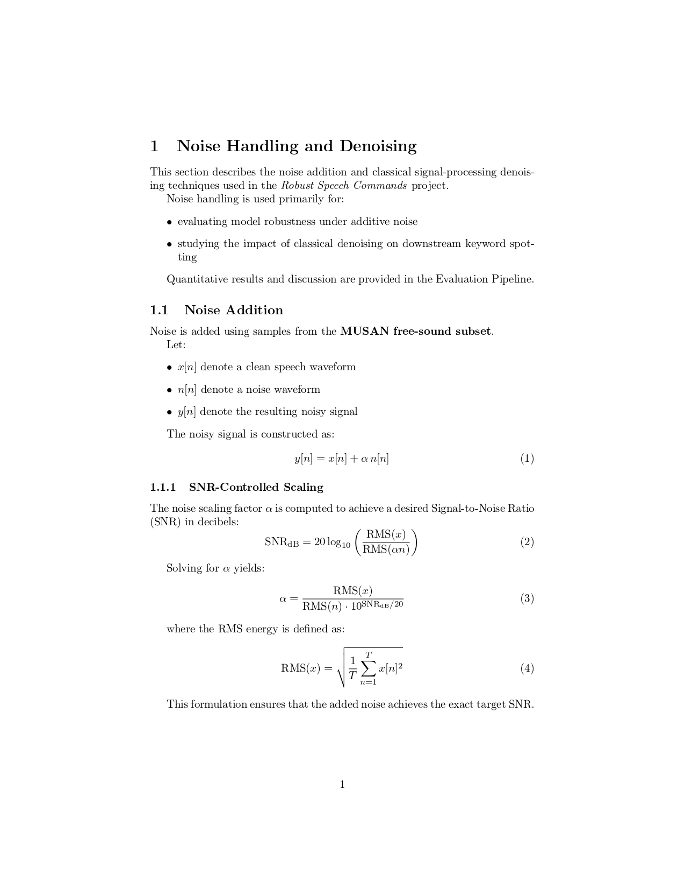
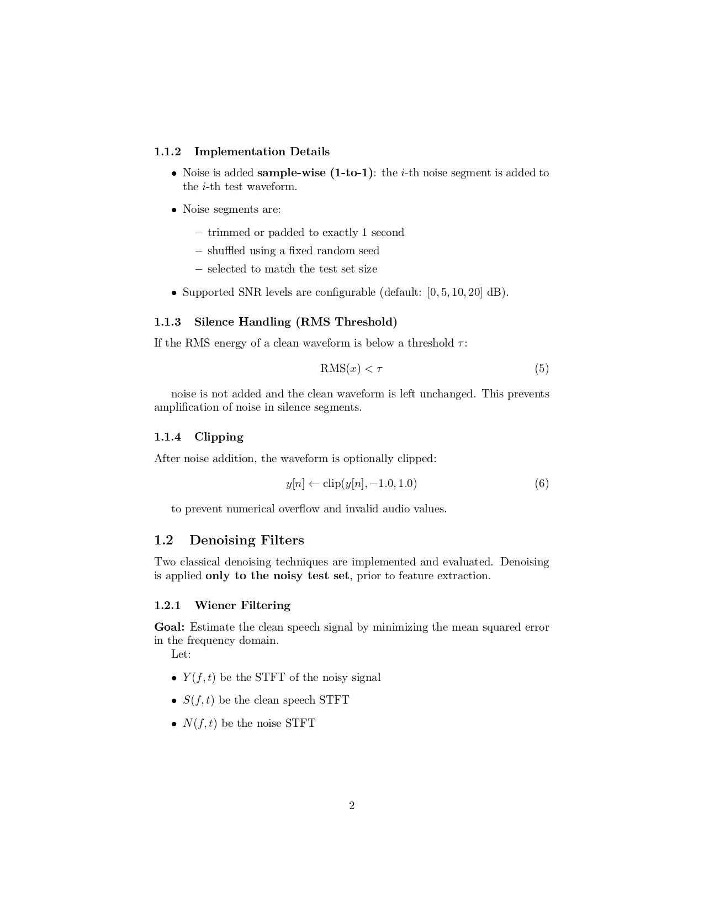
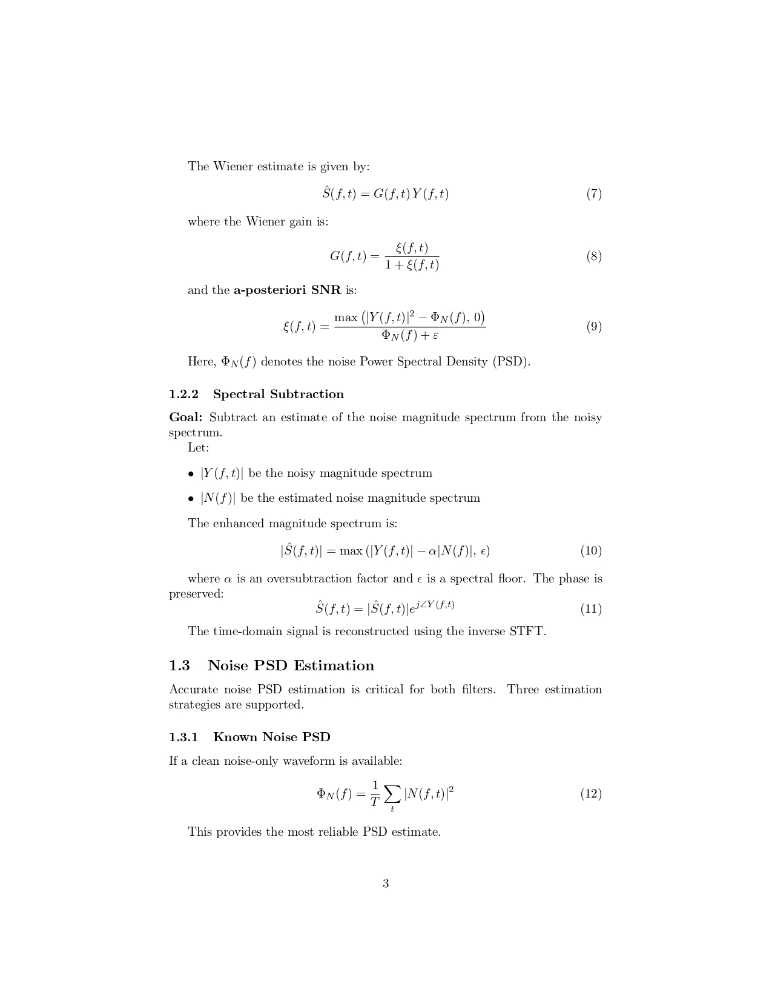
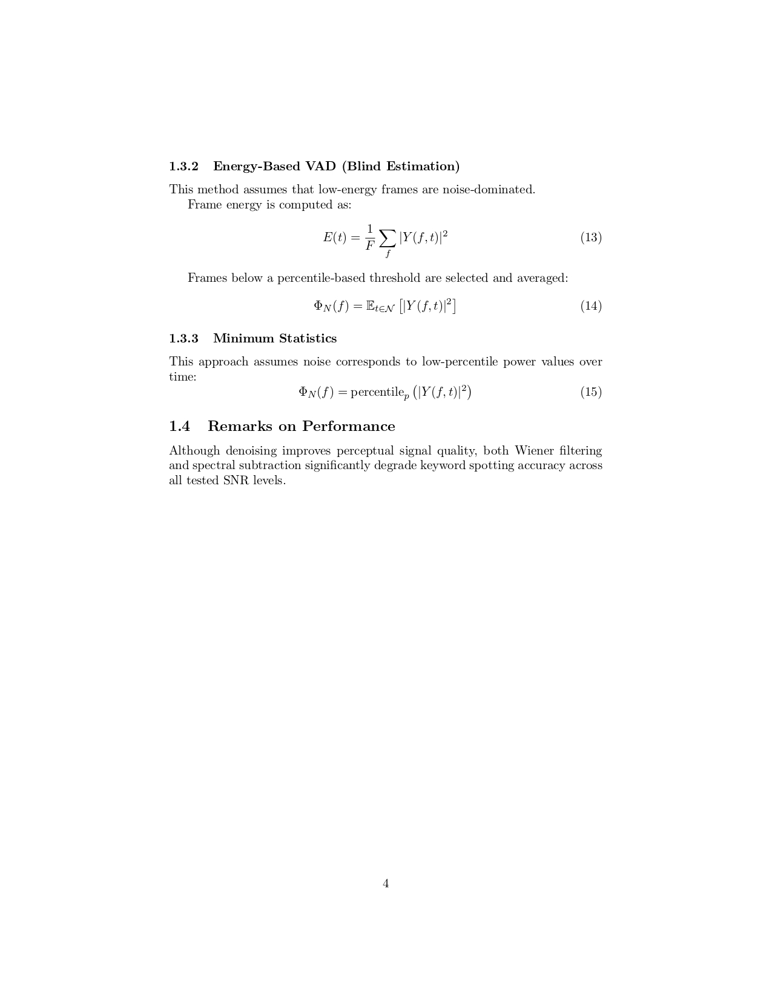

# Noise Handling and Denoising

This folder contains all scripts related to **noise addition** and **classical signal-processing denoising** used in the Robust Speech Commands project.

Noise handling is used primarily for:

* evaluating model robustness under additive noise
* studying the impact of classical denoising on downstream keyword spotting

For quantitative results and discussion, see the
[Evaluation pipeline](../evaluation/README.md).

---

---

## Remarks on Performance

Although denoising improves perceptual signal quality, evaluation results
show that both Wiener filtering and spectral subtraction **significantly
degrade keyword spotting accuracy** across all SNR levels.

A detailed analysis and discussion of these results can be found in the
[Evaluation pipeline](../evaluation/README.md).

---

> **Next:** Test real-time keyword detection using the [Realtime pipeline](../realtime/README.md).

---