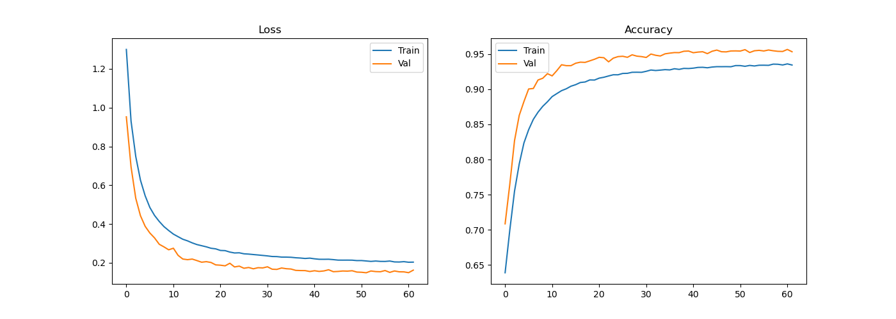

# Training Pipeline

This folder contains the training pipeline for the **Robust Speech Commands** project.

The training pipeline is responsible for:

- Training a CNN-based keyword spotting model
- Saving trained model checkpoints  
- Plotting and saving training curves  

---

## Dataset

We use **Google Speech Commands v0.0.3**.

| Split             | Size (samples) |
|-------------------|----------------|
| Training          | 85,511         |
| Validation        | 10,102         |
| Test              | 4,890          |
| **Total classes** | **12**         |

### Command Set

The model is trained on all **12 classes** provided by the dataset:

`down, go, left, no, off, on, right, stop, up, yes, _silence_, _unknown_`

> `_silence_` and `_unknown_` are included during training to improve robustness and generalization.
> During realtime inference, predictions may therefore result in `_silence_` or `_unknown_`. But they are not printed in terminal. See [Realtime inference](../realtime/README.md) for more details.

---

## Feature Extraction

- **Primary feature**: MFCC  
- **Normalization**: Cepstral Mean and Variance Normalization (CMVN)

CMVN statistics (`mean`, `std`) are computed **only on the training set** and reused for:

- Validation
- Test
- Noisy evaluation
- Realtime inference

> Although STFT and Mel features are supported by the codebase, the current training pipeline **expects MFCC features only**.  
> See [Feature Extraction](../data/README.md) for details and limitations.

The model input shape is:

`(batch_size, 1, F, T)`

where:

- `F` = MFCC feature dimension (including deltas if enabled)
- `T` = number of time frames

---

## Training Details

### Model

- **Architecture**: CNN (`KeywordSpottingNet`)
- **Framework**: PyTorch
- **Device**: CPU or GPU (auto-detected or explicitly set)

### Loss & Optimizer

The following are **currently fixed in code**:

```python
criterion = nn.CrossEntropyLoss()

optimizer = torch.optim.Adam(
    model.parameters(),
    lr=training.learning_rate,
    weight_decay=training.weight_decay
)
```

⚠️ **Note**: Optimizer type and loss function are not configurable yet.

Making them configurable via Hydra is planned as a future improvement.

## Training Configuration

Key training parameters (Hydra-configurable):

```yaml
training:
  epochs: 100
  batch_size: 64
  learning_rate: 1e-3
  weight_decay: 1e-4
  seed: 42
  deterministic: false

  device: auto   # auto | cpu | cuda

  save:
    enabled: true
    dir: ${hydra:runtime.cwd}/model/checkpoints
    save_best_only: true
    monitor: val_loss   # val_loss | val_acc
    filename: best_model.pt

  plotting:
    save: true
    dir: ${hydra:runtime.cwd}/model/plots
    filename: training_curves.png
    show: true

  early_stopping:
    enabled: true
    patience: 10
```

### Example: Change epochs at runtime:

```bash
python main.py pipeline=[train] training.epochs=150
```

> All training-related hyperparameters can be overridden in this way.

## Training Curves

### Loss and Accuracy 

 
*Training and validation loss and accuracy (y-axis) across epochs (x-axis).* 

---

## Saved Artifacts

After training completes, the following artifacts are produced.

### Model Checkpoints (model/checkpoints/)

- Best model checkpoint (`.pt`) per training run

- Timestamped filenames to avoid overwriting

- Pretrained checkpoints (CPU & GPU) are provided

### Training Plots (model/plots/)

- Loss and accuracy curves (`.png`)

- Plots from pretrained runs are included

---

## References

- [PyTorch Neural Networks](https://pytorch.org/docs/stable/nn.html)
- [Google Speech Commands Dataset](https://www.tensorflow.org/datasets/catalog/speech_commands)
- [Adam Optimizer](https://pytorch.org/docs/stable/generated/torch.optim.Adam.html)
- [Cross Entropy Loss](https://pytorch.org/docs/stable/generated/torch.nn.CrossEntropyLoss.html)

---

> Next: You can evaluate the trained model using the [Evaluation pipeline](../evaluation/README.md).
